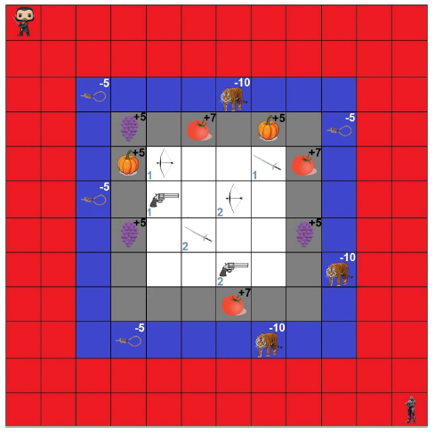
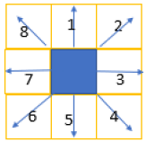
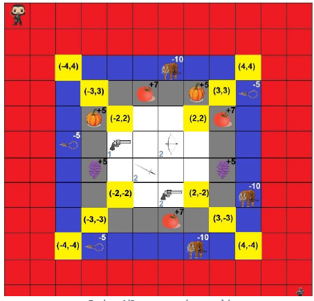
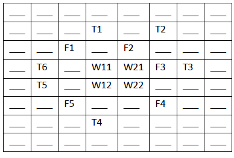

# Data-Structures

This repository contains the assignments for the Academic Course "Data Structures" taught in the Winter of 2019-2020 in Aristotle University of Thessaloniki - Electrical & Computer Engineering. The project was written in Java.

The goal this assignment is the creation of a board game simulator, which is named "Hunger Games" and is developed on the Eclipse IDE. The project consists of two Parts.

### Part A - Random Movement

In this part of the project a board is created and two players are placed antidiametrically as below.

    

The two players move alternately and can only approach a neighboring cell.

    

Every three rounds the board is getting smaller, by cutting off the edges, if possible. The goal of each player is to collect points, by moving to cells that contain food and avoid the traps. Moreover a player can pick a weapon that is found on the map, in order to destroy a potential trap. Specifically the pistol is used to kill the enemy, when the distance between the to players is small enough, the sword is used to destroy the rope-traps and the bow is used to destroy the animal-traps. When a player kills another or when the board is 4x4, the game is over and the player with the most points is the winner.

The project consists of six classes: **Weapon, Food, Trap, Board** and **Player**. The three first of them are just modeling the items, their locations and features. Every class of them contains the **constructors**, as well as the **setters** and the **getters**.

#### Board

This class is responsible for creating the initial board with the players, the weapons, the food and the traps, using the functions: **createRandomWeapon()**, **createRandomFood()**, **createRandomTrap()**, which are called inside the **createBoard()**.

    

Furthermore, inside this class the function to resize the board is created, as well as a function to get a String representation of the board to print to the console: **void resizeBoard(Player p1, Player p2)**,  **String[][] getStringRepresentation()**

The game is represented as follows:

    

* T stands for Traps

* F stands for Food

* Wij is the weapon number j for the player number i

#### Player

This class is responsible for generating a random move for each player.  It contains the functions **public int[] getRandomMove()** and **int[] move()**, So by rolling a digital dice, the new position of the player is calculated, under the condition that the player remains in board. The second function checks the results of the move. If a player falls on a Trap or Food, his points will change and the item will disappear from the board.

#### Game

This class contains the starting point of the program, the main function. Initially a board is generated and the two players are placed on it. Subsequently, the two players roll the dice alternately inside an infinity loop and after their movements, the board is printed through the representation. When the dimension N of the map is equal with 4, the game is over. The player with the most points is the winner.

### Part B - Heuristic Algorithm 

In this part a Heuristic player is created, who has the ability to set the dice needed in each round to make the best possible movement.  

A function that evaluates the available moves is created. The evaluation function takes into account all the available  data. The player's goal is to collect the weapons needed to fight (gainWeapons), to fall into fewer traps that can not avoid (avoidTraps), earn the most points (gainPoints) and moves towards the opponent in order to kill him (forceKill). 

#### HeuristicPlayer

This class represents the player that uses strategy. It inherits the class Player. All data up to now are available on this class and the player can see only one part of the board that corresponds to radius r around it. The player chooses the best move after the evaluation, which is printed to the console. 

#### Game 

This class contains the starting point of the program, the main function and it initializes the different parameters. Two heuristic players are generated and the same process as Part A follows. If both players are still alive after the board shrinks, the one with the most points is the winner.

## Authors:

* [Konstantinos Diamantis](https://github.com/konstantd)

* [Dimitrios-Marios Exarhou](https://github.com/exarchou) 

  